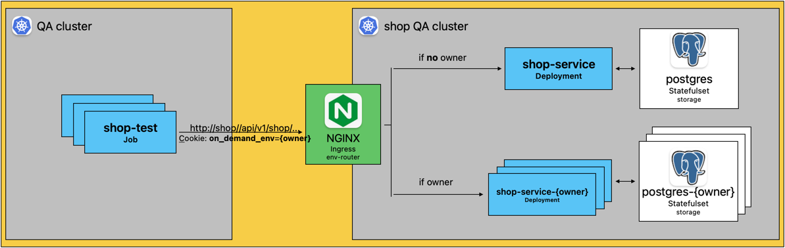

# Shop Test

[](https://github.com/hubzaj/shop-server)
[](https://github.com/hubzaj/shop-test/tree/main#working-with-terminal)
[](https://hub.docker.com/r/hubertzajac6/shop-test)

## Background

The objective of this project was to develop a testing framework for the [shop-server](https://github.com/hubzaj/shop-server) application.
- The test framework was built using [JUnit 5](https://junit.org/junit5/) and [REST Assured](https://rest-assured.io/).
- By default, all tests, both suites and cases, are [configured](https://github.com/hubzaj/shop-test/blob/main/src/test/resources/junit-platform.properties) to run in parallel.
- The tests are containerized using Docker, and they can be executed within a Kubernetes cluster as a job, thanks to the Helm Chart configuration.
- Additionally, the tests can be conducted against various deployments of the shop-service, facilitated by the nginx env-router and the suffixed deployment option.

## Architecture

###### Test infrastructure


## How to build project

Requirements:

-     java 17
-     Maven 3

### Working with terminal

1. Install `asdf` with required plugins.

 ```
  > brew install asdf
  > asdf plugin-add java
  > asdf plugin-add maven
  > asdf install
 ```

### How to run

Tests can be executed both locally in an IDE, within a Docker container, and in a Kubernetes cluster as a job.

The tests are located in the `src/test/java/org/shop/test` directory.

* To run selected tests inside a Docker container, use the command `make run-integration-tests-in-docker`.
* For executing selected tests in a Kubernetes cluster, use the command `make deploy-shop-test-job`. 
  * To view the test results, execute `make display-test-result`. 
  * Cleanup steps can be performed using `make teardown-shop-test-job`.

### Configuration

The configuration is structured to be managed through environment variables.

The supported environment variables include:
* `SHOP_HOST_ENV`
* `SHOP_PORT_ENV`
* `SHOP_BASE_API_URL_ENV`
* `SHOP_ON_DEMAND_SUFFIX_ENV` - if provided, tests are directed to the shop-service deployment with the specified suffix
